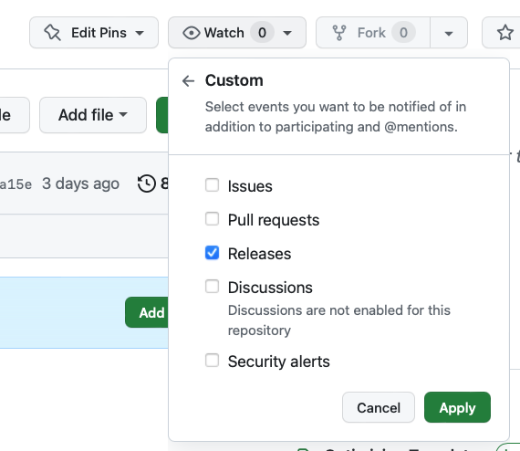

# Introduction
The templates within this repository follow best practices and make is easier for teams to deploy their infrastructure using terraform. These templates follow a release methodology. Please see [here](https://github.com/ca-yorku-uit-shared/templates/tags) for the latest tag you should use. Each tag should be accompanied by a change log and identify breaking changes to make it easier to upgrade. 

<span style="color:red">__Note__:</span>  To keep up to date with the changes:



 * Click on the "Watch" icon, select "Custom" and check "Releases". 
 * Click "Apply"


## Variables
Each of the templates below use and reuse the following variables to achieve a desired outcome. Most of these variables already have default values to ensure compliance with York University standards. However, teams are allowed to over-ride them should they have a strong business case to veer from standards. 

### Required
__targetEnv__ - The environment to target. This corresponds to the envirinments within the github repository and are generally dev,qa or prod

### Optional

_commandOptions_ - Additional command options to supply to terraform. default is '-var-file=variables/\<targetEnv>.tfvars'.

_storageSubscriptionId_ - The subscription that contains the storage account which contains the terraform state files.Default is "e90a7ed9-4cc7-42e6-be46-89ed0bcc42ae" which is the "YorkU-CoreManagement" subscription.

_storageTenantId_ - The tenant for the subscription. Default is "34531318-7011-4fd4-87f0-a43816c49bd0" which is the id for the Yorku Azure AD Tenant 

_storageResourceGroup_ - The resource group that contains the storage account which contains the terraform state files. Default is "RG-YU-CC-tfstate-all"

_storageAccountName_ - The storage account which contains the terraform state files. Default is "yucctfstate01"

_storageContainerName_ - The container within the storage account where the terraform state files will be stored. Default is "${{github.repository_owner}}" which corresponds to the github organization the template is being invoked from. For example, if the invoking pipeline is in a github organization called "ca-yorku-icti" then the value for the storage container name will be "ca-yorku-icti".

<span style="color:red">__Note__:</span> A container with the organization name must already exist in the storage account.

_additionalBackendConfig_ - Any additonal backend configuration that needs to be passed to the terraform command line. Default is "use_oidc=true"

_storageKey_ - This is the name and path of the terraform state file. It is dependant on the targetEnv as well as the repository it is being run from. Default is "\<targetEnv>/<github.event.repository.name>.tfstate". For example, if you are running actions for the "dev" environment from a repository named "tf_resourcegroup_pipeline", then the tfstate file will be in a folder called "dev" and will be called "tf_resourcegroup_pipeline.tfstate". 

_varFile_ - If a value for this is supplied, the workflow will look for a file called "\<varFile>.tfvars" in the variables folder. Otherwise, it will fall back to "\<envName>.tfvars"

_runsOnGroup_ - This is the name of the runner group defined at the enterprise level that is available for everyone to use. Default is "yorku-shared-runners-new".

<span style="color:red">__Note__:</span> Anytime a new organization is created, explicit permissions must be given at the enterprise level for the organization to be able to use this runner group. When creating a new repository, permissions must be given at the organization level to be able to use this runner group. 

## Templates

### tf-unit-tests.yml
The unit test template will perform the following functions:
1. Initialize terraform without a backend
2. Validate the code
3. Check formatting
4. Lint the code based on a terraform and azure plugin
5. Perform a security scan of the code using checkov

#### Example Usage
The following example will run the unit tests and a terraform plan against the dev environment. Note that each invocation points to a release eg release/v0.4. Please see [here](https://github.com/ca-yorku-uit-shared/templates/tags) for the latest tag to use.

  ````yaml
  name: 'Terraform Unit Tests'
run-name: Plan dev from ${{github.ref_type}} "${{github.ref_name }}" by @${{ github.actor }}

on:
  workflow_dispatch:

  push:
    branches-ignore:
      - 'main'
      - 'release/*'

permissions:
  id-token: write
  contents: read
      
jobs:
  unit-tests:
    name: 'Terraform Unit Tests'
    uses: ca-yorku-uit-shared/templates/.github/workflows/tf-unit-tests.yml@release/v0.4
    secrets: inherit
  dev-plan:
    name: 'Terraform Dev Plan'
    needs: [unit-tests]
    uses: ca-yorku-uit-shared/templates/.github/workflows/tf-plan.yml@release/v0.4
    with:
      targetEnv: dev
    secrets: inherit
  ````


### tf-plan.yml
This template will initialize terraform against the azure backend and create a plan based on the targetEnv variable specified. It will then publish this plan as a summary for the workflow. 
Note that each invocation points to a release eg release/v0.4. Please see [here](https://github.com/ca-yorku-uit-shared/templates/tags) for the latest tag to use.
#### Example Usage

  ````yaml
  name: 'Terraform QA and Prod Planning'
run-name: Plan from ${{github.ref_type}} "${{github.ref_name }}" by @${{ github.actor }}

on:
  push:
    tags:
       - 'release/*'

permissions:
  id-token: write
  contents: read
      
jobs:
  unit-tests:
    name: 'Terraform Unit Tests'
    uses: ca-yorku-uit-shared/templates/.github/workflows/tf-unit-tests.yml@release/v0.4
    secrets: inherit

  plan_stage:
    name: 'Plan staging'
    uses: ca-yorku-uit-shared/templates/.github/workflows/tf-plan.yml@release/v0.4
    needs: [unit-tests]
    with:
      targetEnv: qa
    secrets: inherit

  plan_production:
    name: 'Plan production'
    needs: [unit-tests]
    uses: ca-yorku-uit-shared/templates/.github/workflows/tf-plan.yml@release/v0.4
    with:
      targetEnv: prod
    secrets: inherit

  ````

### tf-apply.yml
This template will initialize terraform against the azure backend,create a plan based on the targetEnv variable specified, run the apply and publish the output to the workflow summary.  
Note that each invocation points to a release eg release/v0.4. Please see [here](https://github.com/ca-yorku-uit-shared/templates/tags) for the latest tag to use.
#### Example Usage
  ````yaml
  name: 'Terraform Stage and Prod Deployment'
run-name: Deploy to ${{ inputs.targetEnv }} from ${{github.ref_type}} "${{github.ref_name }}" by @${{ github.actor }}

on:
  workflow_dispatch:
    inputs:
      targetEnv:
        required: true
        description: Which Environment to deploy to
        type: choice
        options: 
            - qa
            - prod


permissions:
  id-token: write
  contents: read
      
jobs:
  unit-tests:
    name: 'Terraform Unit Tests'
    uses: ca-yorku-uit-shared/templates/.github/workflows/tf-unit-tests.yml@release/v0.4
    secrets: inherit

  deploy:
    name: 'Deploy ${{ inputs.targetEnv}}'
    uses: ca-yorku-uit-shared/templates/.github/workflows/tf-apply.yml@release/v0.4
    needs: [unit-tests]
    with:
      targetEnv: ${{ inputs.targetEnv}}
    secrets: inherit

  ````
### tf-drift.yml
This template creates a plan for each environment and checks for drift. It uses the tf-plan template internally. If a drift is found, it will open a github issue.   
Note that each invocation points to a release eg release/v0.4. Please see [here](https://github.com/ca-yorku-uit-shared/templates/tags) for the latest tag to use.
#### Example Usage
  ````yaml
  name: 'Terraform Configuration Drift Detection'

on:
  workflow_dispatch: 
  schedule:
    - cron: '41 3 * * *' # runs nightly at 3:41 am

permissions:
  id-token: write
  contents: read
  issues: write
    
jobs:
  plan_dev:
    name: 'Check dev drift'
    uses: ca-yorku-uit-shared/templates/.github/workflows/tf-drift.yml@release/v0.4
    with:
      targetEnv: dev
    secrets: inherit

  plan_qa:
    name: 'check qa drift'
    uses: ca-yorku-uit-shared/templates/.github/workflows/tf-drift.yml@release/v0.4
    with:
      targetEnv: qa
    secrets: inherit
  
  plan_prod:
    name: 'Check prod drift'
    uses: ca-yorku-uit-shared/templates/.github/workflows/tf-drift.yml@release/v0.4
    with:
      targetEnv: prod
    secrets: inherit

  ````
### tf-complete-with-github-runner.yml
This template was created for managing edge case items like github runners. It will unit test, plan and apply using the default "ubuntu-latest" runners from GitHub. It essentially functions like a combination of unit-test, plan and apply templates but has addtional steps to install software since it's running on default runners. The software, like terraform, tflint and checkov is already installed on yorku runners to save execution time and standardize environments for workflows. 

## Example
For further instructions on how to use these templates within your own repository and see a working example, please click [here](https://github.com/ca-yorku-icti/terraform-action-template)
